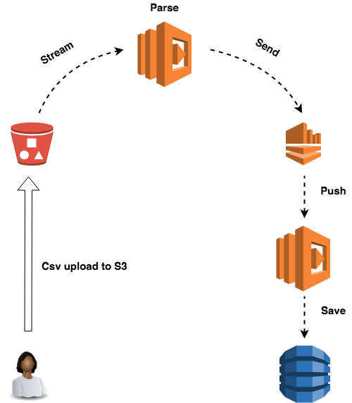

# Save your CSV files to DynamoDB (Serverless)

You can easily upload your CSV files and get them saved to DynamoDB. How does it work?

1. git clone
2. Change the bucket name inside `package.json`. The bucket name needs to be unique.
3. Chagne the bucket name insie `template.yaml`. The bucket name needs to be unique.
4. Run `npm run bucket` to create your S3 bucket to upload your Cloudformation template + dependencies.
5. Run `npm ru qd` to create a new stack with all resources.
6. Inside `package.json` under `scotty` add the `s3://bucket-url` that was created by Cloudformation see step 3.
7. run `npm run scotty` it will upload the sample file to your bucket and the parsing process will start automatically.
8. Have fun!

